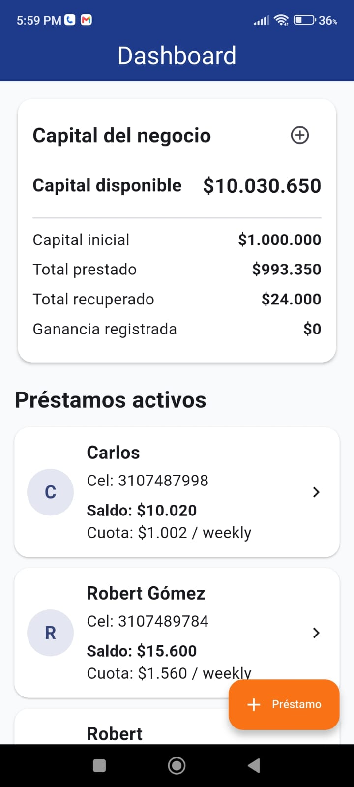
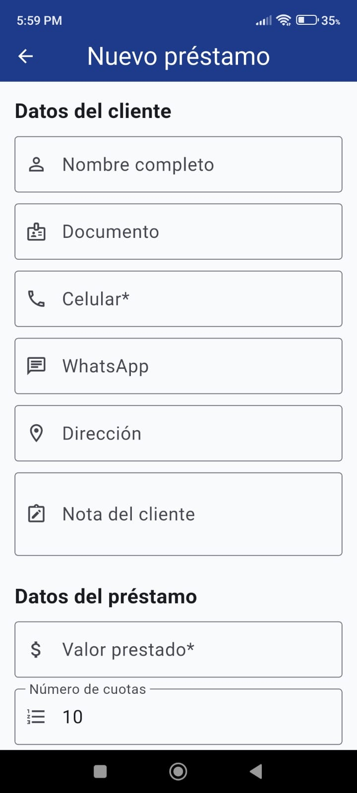

# App Administración de Préstamos — Case Study

App móvil en desarrollo para la administración de clientes, préstamos, saldos, abonos y movimientos financieros. El proyecto está construido con Flutter, Dart y Firebase, aplicando una estructura organizada por capas y buenas prácticas de desarrollo móvil.

> Este repositorio es una presentación del proyecto para portafolio. El código fuente completo se mantiene privado mientras el proyecto está en desarrollo.

## Objetivo del proyecto

El objetivo de esta aplicación es permitir que un prestamista pueda administrar su operación desde el celular, registrando clientes, creando préstamos, controlando pagos, visualizando saldos pendientes y consultando movimientos del negocio.

## Tecnologías utilizadas

- Flutter
- Dart
- Firebase
- Cloud Firestore
- Android
- Git / GitHub
- Clean Architecture en proceso de implementación

## Estado del proyecto

Proyecto en desarrollo activo.

Actualmente se está trabajando en la estructura base del sistema, dashboard, registro de clientes, creación de préstamos, manejo de capital, movimientos y lógica de pagos.

## Funcionalidades planificadas

- Registro de clientes.
- Creación de préstamos.
- Dashboard con resumen de préstamos activos.
- Manejo de capital disponible.
- Registro de pagos y abonos.
- Ampliación de crédito.
- Cálculo de saldo pendiente.
- Historial de movimientos.
- Recalculo de cuotas y tiempo restante.
- Generación de PDF.
- Compartir reportes por WhatsApp.
- Autenticación de usuarios.
- Reportes básicos del negocio.

## Funcionalidades en desarrollo

- Pantalla principal / dashboard.
- Flujo de creación de cliente y préstamo.
- Estructura de datos en Firebase.
- Organización del proyecto con separación de responsabilidades.
- Lógica inicial para manejo de capital y movimientos.

## Rol en el proyecto

Proyecto desarrollado de forma independiente como parte de mi portafolio profesional en desarrollo móvil. En este proyecto estoy trabajando en el análisis del flujo de negocio, diseño de pantallas, estructura de datos, integración con Firebase y organización del código siguiendo principios de arquitectura limpia.

## Aprendizajes principales

Durante el desarrollo de este proyecto estoy fortaleciendo conocimientos en:

- Modelado de datos para aplicaciones financieras.
- Organización de proyectos Flutter por capas.
- Integración con Cloud Firestore.
- Manejo de formularios y validaciones.
- Diseño de flujos de negocio.
- Gestión de estados de carga y errores.
- Registro de movimientos financieros.
- Preparación de reportes para usuarios.
- Buenas prácticas de mantenimiento del código.

## Próximas mejoras

- Finalizar flujo completo de creación de préstamo.
- Implementar registro de pagos.
- Implementar detalle del préstamo.
- Agregar historial de movimientos.
- Implementar generación de PDF.
- Mejorar validaciones del formulario.
- Agregar autenticación.
- Realizar pruebas funcionales.

## Capturas

### Dashboard

### Crear cliente y préstamo

